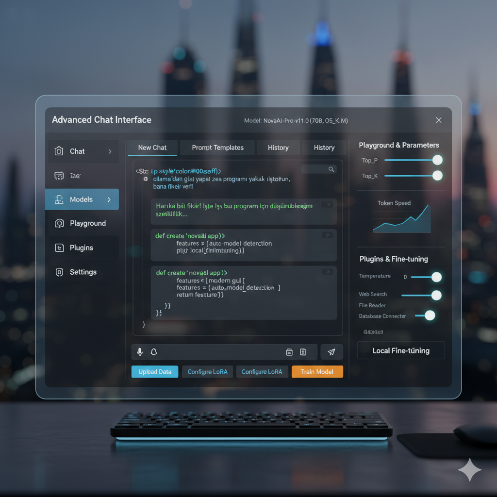

# KayaVuln - Gelişmiş Yerel LLM Arayüzü - Advanced-AI-LLM-Interface - Ollama



## 🌟 Proje Hakkında

KayaVuln, yerel (local) Büyük Dil Modellerini (LLM - Large Language Models) kolayca yönetmek ve onlarla etkileşim kurmak için geliştirilmiş, modern ve kullanıcı dostu bir masaüstü uygulamasıdır. Ollama gibi mevcut çözümlerden ilham alarak, daha gelişmiş bir grafik kullanıcı arayüzü (GUI), sezgisel model yönetimi ve eklenebilirlik (plugin) özellikleriyle fark yaratmayı hedefler.

Bu proje, Python ve PyQt5 kullanılarak geliştirilmiştir.

### ✨ Temel Özellikler

*   **Modern ve Duyarlı GUI:** Şık bir koyu tema ile donatılmış, akıcı ve sezgisel bir kullanıcı deneyimi sunar.
*   **Otomatik Model Algılama:** Belirlenen dizindeki `.gguf` uzantılı LLM modellerini otomatik olarak tarar ve listeler.
*   **Gelişmiş Sohbet Arayüzü:**
    *   Yüklenen modeller arasında kolay geçiş imkanı.
    *   Mesaj göndermek için `Enter`, yeni satıra geçmek için `Shift+Enter` desteği.
    *   Ayarlar üzerinden değiştirilebilir LLM parametreleri (sıcaklık, top_p, top_k vb.).
*   **Komut Satırı Arayüzü (CLI):** Modelleri listeleme, indirme ve silme gibi işlemleri terminalden yapma imkanı.
*   **Model İndirme:** Hugging Face Hub üzerinden kolayca yeni LLM modellerini indirebilme (CLI aracılığıyla).
*   **Eklenti (Plugin) Sistemi:** Uygulamanın yeteneklerini genişletmek için harici Python betiklerini (örneğin web araması, dosya okuma) entegre etme.
*   **Kişiselleştirilebilir Ayarlar:** LLM parametreleri, tema tercihleri ve diğer uygulama ayarları için ayrı bir sayfa.

## 🚀 Başlangıç

Bu projeyi yerel makinenizde çalıştırmak için aşağıdaki adımları takip edin.

### Ön Koşullar

*   Python 3.8+ (Tercihen 3.10 veya üzeri)
*   `git` (projeyi klonlamak için)

### Kurulum Adımları

1.  **Projeyi Klonlayın:**
    ```bash
    git clone https://github.com/vulnkya/KayaVuln.git](https://github.com/vulnkya/KayaVuln-Gelismis-LLM-Arayuzu-Advanced-AI-LLM-Interface-Ollama-Similar.git
    cd KayaVuln
    ```
    *(`KULLANICIADINIZ` ve `KayaVuln` kısmını kendi GitHub kullanıcı adınız ve depo adınızla değiştirin.)*

2.  **Sanal Ortam Oluşturun ve Aktive Edin (Şiddetle Tavsiye Edilir):**
    ```bash
    python3 -m venv venv
    source venv/bin/activate
    ```
    *(Terminal prompt'unuzun başında `(venv)` yazdığını görmelisiniz.)*

3.  **Gerekli Kütüphaneleri Yükleyin:**
    `requirements.txt` dosyanızın projenin kök dizininde olduğundan emin olun ve aşağıdaki komutu çalıştırın:
    ```bash
    pip install -r requirements.txt
    ```
    Bu komut, `PyQt5`, `llama-cpp-python`, `requests`, `pypdf`, `typer`, `rich` ve `huggingface_hub` gibi tüm gerekli bağımlılıkları sanal ortamınıza kuracaktır.

    > **`llama-cpp-python` Hakkında Not:** Bu kütüphane, LLM çıkarımı için C++ tabanlı bir motor kullanır. Kurulumu, sisteminizdeki derleyici araçlarına (macOS'ta Xcode Command Line Tools gibi) ihtiyaç duyabilir. Eğer GPU hızlandırması kullanmak istiyorsanız, daha özel kurulum adımları gerekebilir (örneğin `CMAKE_ARGS="-DLLAMA_CUBLAS=on" pip install llama-cpp-python --force-reinstall`). Çoğu kullanıcı için varsayılan CPU kurulumu yeterlidir.

4.  **LLM Modeli İndirin:**
    Uygulamayı çalıştırabilmek için en az bir `.gguf` uzantılı Büyük Dil Modeli'ne ihtiyacınız var. En kolay yol, CLI komutunu kullanmaktır:

    ```bash
    # Örnek: TinyLlama-1.1B-Chat-v1.0 modelini indirme
    python main.py download-model "TheBloke/TinyLlama-1.1B-Chat-v1.0-GGUF" "tinyllama-1.1b-chat-v1.0.Q2_K.gguf"
    ```
    *   `"TheBloke/TinyLlama-1.1B-Chat-v1.0-GGUF"`: Hugging Face deposunun ID'si.
    *   `"tinyllama-1.1b-chat-v1.0.Q2_K.gguf"`: İndirilecek dosyanın adı.
    
    Bu komut, modeli `KayaVuln/models/` klasörüne kaydedecektir. Daha fazla model için [Hugging Face Hub](https://huggingface.co/models) adresini ziyaret edebilirsiniz (filtre olarak GGUF seçin).

5.  **Örnek Pluginleri Kopyalayın:**
    `plugins/` klasörünüzde `example_web_search.py` ve `example_file_reader.py` dosyalarının bulunduğundan emin olun. Bu dosyalar `KayaVuln/plugins/` dizini içinde yer almalıdır.

### 🚀 Uygulamayı Çalıştırma

Sanal ortamınız aktifken (terminalde `(venv)` gördüğünüzden emin olun):

*   **GUI'yi Başlatmak İçin:**
    ```bash
    python main.py
    # veya açıkça GUI'yi başlatmak için:
    python main.py gui
    ```

*   **CLI Komutlarını Kullanmak İçin:**
    ```bash
    # Tüm yerel modelleri listele
    python main.py list-models

    # Yeni bir model indir (yukarıdaki örneğe bakınız)
    python main.py download-model "RepoID" "filename.gguf"

    # Bir modeli sil
    python main.py delete-model "model_adı" # (örn. tinyllama-1.1b-chat-v1.0.Q2_K)
    ```

## 🛠️ Özelleştirme ve Geliştirme

*   **Yeni Pluginler Ekleme:** `plugins/` klasörüne yeni `.py` dosyaları ekleyerek kendi fonksiyonelliğinizi oluşturabilirsiniz. Her plugin'in `run(args...)` adında bir fonksiyon içermesi gerekir.
*   **Arayüz Stilleri:** `ui/main_window.py` ve diğer `ui` dosyalarındaki `setStyleSheet` metodlarını düzenleyerek veya harici bir `.qss` (Qt Style Sheet) dosyası bağlayarak arayüzün görünümünü tamamen değiştirebilirsiniz.
*   **LLM Parametreleri:** `Settings` sayfasındaki kaydırıcılar ve giriş alanları aracılığıyla LLM çıkarım parametrelerini kişiselleştirin.
*   **Tema:** `Settings` sayfası aracılığıyla tema tercihlerinizi yönetin.
